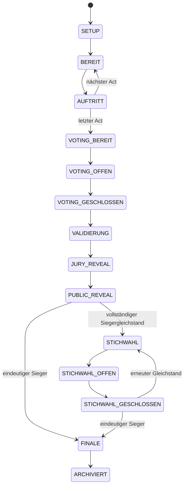
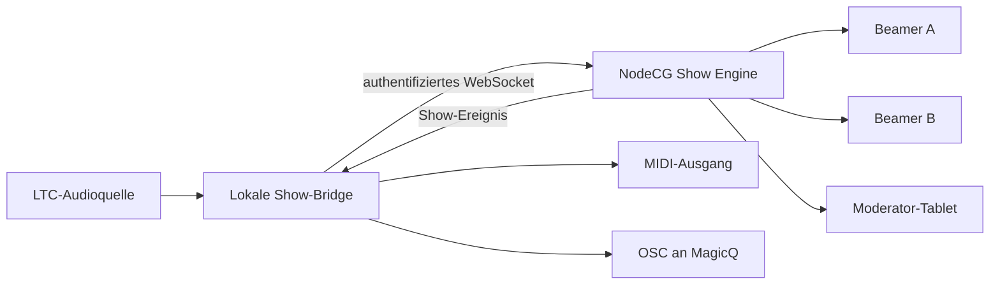
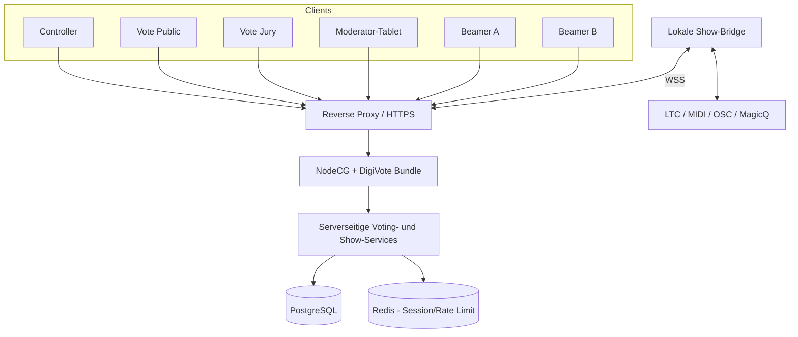

# Technisches Pflichtenheft - PastEurovision DigiVote

**Status:** Entwurf 1.0  
**Stand:** 26. September 2026  
**Ziel:** Produktionsreifes, NodeCG-basiertes Voting- und Präsentationssystem für PastEurovision  
**Zielszenario:** 12 bis 15 Acts, etwa 50 Personen vor Ort, Jury- und Publikumsvoting, zwei unabhängige Full-HD-Beamerausgaben

---

## 1. Zweck und Zielbild

PastEurovision DigiVote steuert den digitalen Ablauf einer PastEurovision-Veranstaltung. Das System verbindet:

- die zentrale Regieoberfläche,
- das öffentliche Smartphone-Voting,
- das authentifizierte Jury-Voting,
- das Moderator-Tablet,
- zwei voneinander unabhängige Beamerausgaben,
- LTC-basierte Einblendungen während der Auftritte,
- optionale MIDI-/OSC-Cues für MagicQ,
- revisionssichere Speicherung, Korrektur und Export aller Ergebnisse.

Das System muss zunächst vollständig lokal testbar sein und später ohne Architekturwechsel per Docker auf einem Contabo-Server betrieben werden können. Externe Show-Hardware am Veranstaltungsort wird über einen lokalen Bridge-Dienst angebunden.

### 1.1 Leitprinzipien

1. **Regiehoheit:** Keine Automatik darf die manuelle Kontrolle der Regie ersetzen. Jeder automatische Schritt besitzt ein manuelles Fallback.
2. **Serverseitige Wahrheit:** Wertungen und Showzustand werden ausschließlich serverseitig validiert und gespeichert.
3. **Wiederaufnahmefähigkeit:** Nach Browser-Neuladen, Netzwerkunterbrechung oder Neustart wird exakt der zuletzt bestätigte Zustand wiederhergestellt.
4. **Nachvollziehbarkeit:** Stimmen werden nicht gelöscht, sondern versioniert, gesperrt oder storniert. Änderungen bleiben im Audit-Log sichtbar.
5. **Konfigurierbarkeit:** Punkteskala, Gewichtung, Eigenwahl, Reveal-Ablauf, Screens und Show-Cues werden pro Veranstaltung konfiguriert.
6. **Klare Trennung:** NodeCG steuert Show und Darstellung; PostgreSQL hält die dauerhaften Daten; der lokale Bridge-Dienst kommuniziert mit LTC- und Lichttechnik.

## 2. Abgrenzung

### 2.1 Bestandteil der ersten produktionsreifen Version

- Verwaltung von Veranstaltungen, Ländern, Acts, Artists und Jury-Mitgliedern
- Many-to-many-Zuordnung zwischen Artists und Acts
- Jury- und Publikumsvoting mit konfigurierbarer ESC-Punkteskala
- Standardpunkteskala `1, 2, 3, 4, 5, 6, 7, 8, 10, 12`
- Vollständigkeits- und Eindeutigkeitsprüfung eines Stimmzettels
- Optionale Sperre eigener Acts je Jury-Mitglied
- Publikumssitzung über sicheres Browser-Cookie
- Öffnen, Schließen, Sperren, Entsperren und Korrigieren von Abstimmungen
- Exakte Normalisierung des Publikumsergebnisses auf ein konfiguriertes Gewicht
- Jury-Reveal und Publikumspunkte-Reveal im ESC-Stil
- Moderatorvorschau genau einen Schritt vor der Beamerausgabe
- Zwei unabhängige 1920x1080-Beamerausgaben
- LTC-Eingang für zeitgesteuerten Klarnamen-Reveal
- Ereignisbasierte MIDI-/OSC-Ausgabe über lokalen Bridge-Dienst
- Stichwahl bei vollständigem Gleichstand
- CSV-Import mit Vorschau und Validierung
- CSV-/JSON-Ergebnisexport und druckbarer Ergebnisbericht
- Docker-basierter lokaler und späterer Serverbetrieb
- Audit-Log, Backups und Wiederanlauf

### 2.2 Nicht Bestandteil der ersten Version

- Ermittlung oder Blockierung von MAC-Adressen; Browser können MAC-Adressen nicht auslesen
- Native iOS- oder Android-Apps
- Vollautomatische Erkennung realer Personen hinter mehreren Geräten
- Audio-/Videowiedergabe der Songs
- Vollwertige Lichtprogrammierung in MagicQ
- Mehrsprachige Benutzeroberfläche; die erste Version ist deutsch
- Mehrere gleichzeitig aktive NodeCG-Instanzen mit automatischem Cluster-Failover

## 3. Begriffe und Rollen

| Begriff | Bedeutung |
|---|---|
| Veranstaltung | Eine konkrete PastEurovision-Ausgabe mit eigener Konfiguration und eigenen Daten |
| Act | Ein Wettbewerbseintrag mit Land, Flagge, Startnummer und Song |
| Artist | Eine reale Person, die an keinem, einem oder mehreren Acts beteiligt sein kann |
| Jury-Mitglied | Stimmberechtigte Person oder Rolle; optional mit Artists beziehungsweise Acts verknüpft |
| Publikumssitzung | Anonyme Browser-Sitzung, die höchstens einen aktiven Publikumsstimmzettel abgeben darf |
| Stimmzettel | Eine vollständige Zuordnung der konfigurierten Punktwerte zu unterschiedlichen Acts |
| Reveal-Schritt | Kleinste kontrollierbare Einheit der Ergebnispräsentation |
| Showzustand | Persistierter Zustand der laufenden Veranstaltung und aller Ausgaben |
| Sperre | Ausschluss eines Stimmzettels von der Wertung bei Erhalt der Originaldaten |
| Korrektur | Neue Revision eines Stimmzettels oder administrativer Ergebnisanpassung |

### 3.1 Systemrollen

| Rolle | Rechte |
|---|---|
| Administrator | Vollzugriff auf Konfiguration, Benutzer, Deployment-relevante Einstellungen und Datenexport |
| Regie | Vollzugriff auf Showablauf, Voting, Präsentation, Korrekturen und Cues |
| Voting-Operator | Verwaltung und Prüfung von Jury- und Publikumsabgaben, ohne globale Systemeinstellungen |
| Moderator | Lesender Zugriff auf den aktuellen Schritt und die freigegebene Vorschau |
| Jury-Mitglied | Anmeldung mit Name und PIN; Bearbeitung des eigenen Stimmzettels |
| Publikum | Anonyme Teilnahme über QR-Code und Browser-Cookie |
| Beamer | Token-geschützter, ausschließlich lesender Zugriff auf genau einen Ausgabekanal |
| Show-Bridge | Maschinenrolle für LTC-Eingang und MIDI-/OSC-Ausgang |

## 4. Fachliche Regeln

### 4.1 Acts und Artists

- Ein Act besitzt mindestens:
  - interne ID,
  - Startnummer,
  - echtes Land,
  - Landesanzeige, zum Beispiel `Deutschland`,
  - Flaggen-Asset,
  - Artist-Pseudonym,
  - Songtitel,
  - einen oder mehrere beteiligte Artists.
- Jeder Artist besitzt einen Klarnamen.
- Ein Artist kann an mehreren Acts beteiligt sein.
- Ein Act kann aus mehreren Artists bestehen.
- Startnummern sind innerhalb einer Veranstaltung eindeutig.
- Länder dürfen standardmäßig nur einmal vorkommen; diese Einschränkung ist konfigurierbar.

Die sichtbaren Daten eines Acts werden stufenweise freigegeben:

1. Vor dem LTC-Reveal zeigen die mobilen Show-/Votingseiten Pseudonym, Land und Songtitel.
2. Eine konfigurierte LTC-Marke gibt den Artist-Klarnamen auf den mobilen Seiten frei.
3. Die Beamerausgabe zeigt während des Auftritts standardmäßig ausschließlich Land, Flagge und Startnummer.
4. Eine abweichende Zielzuordnung kann später konfiguriert werden, darf aber unveröffentlichte Klarnamen niemals vorzeitig an einen Client übertragen.

### 4.2 Jury-Mitglieder

- Ein Jury-Mitglied ist ein eigenständiger Datensatz und nicht zwingend ein Artist.
- Typische Jury-Typen sind `ARTIST`, `REGIE` und `GAST`.
- Ein Artist kann höchstens einen aktiven Jury-Zugang pro Veranstaltung erhalten, auch wenn er mehreren Acts zugeordnet ist.
- Ein Jury-Mitglied kann mit null bis mehreren Artists oder direkt mit Acts verknüpft werden.
- Jury-Mitglieder ohne Act-Verknüpfung, zum Beispiel die Regie, besitzen keine automatische Eigenwahlsperre.
- Der Anzeigename beim Jury-Reveal ist standardmäßig der Artist-Klarname beziehungsweise der frei definierte Jury-Klarname.
- Der vierstellige PIN wird niemals im Klartext gespeichert.

### 4.3 Eigenwahl

- Standard: Ein Artist darf keinem Act Punkte geben, an dem er beteiligt ist.
- Die Eigenwahlsperre ist veranstaltungsweit konfigurierbar.
- Zusätzlich kann sie pro Jury-Mitglied überschrieben werden.
- Gesperrte Acts werden im Jury-Frontend sichtbar als nicht wählbar markiert.
- Bereits abgegebene Stimmzettel werden bei einer nachträglichen Regeländerung als `PRUEFUNG_ERFORDERLICH` markiert und nicht stillschweigend verändert.

### 4.4 Stimmzettel

- Standardpunkteskala: `1, 2, 3, 4, 5, 6, 7, 8, 10, 12`.
- Jeder Punktwert muss genau einmal vergeben werden.
- Ein Act darf pro Stimmzettel höchstens einen Punktwert erhalten.
- Der Stimmzettel muss vollständig sein.
- Bei weniger auswählbaren Acts als Punktwerten kann die Abstimmung nicht geöffnet werden; die Regie erhält eine konkrete Fehlermeldung.
- Solange eine Abstimmung geöffnet ist, darf ein Stimmzettel geändert und erneut abgesendet werden.
- Jede erneute Abgabe erzeugt eine neue Revision. Nur die jüngste gültige, nicht gesperrte Revision wird gewertet.
- Nach dem Schließen ist eine Änderung nur durch die Regie möglich und muss begründet werden.

### 4.5 Sperren und Korrekturen

- Eine Sperre löscht keine Daten.
- Gesperrte Abgaben werden aus allen Berechnungen und Zwischenergebnissen ausgeschlossen.
- Die Regie kann eine Abgabe entsperren, solange keine endgültige Archivierung erfolgt ist.
- Jede Sperre, Entsperrung oder Korrektur erfordert einen Grund und erzeugt einen Audit-Eintrag.
- Nach einer Korrektur werden alle betroffenen Scoreboard-Snapshots neu berechnet.
- Wurde ein betroffenes Ergebnis bereits präsentiert, zeigt der Controller deutlich den Zustand `ERGEBNIS GEÄNDERT` und verlangt eine bewusste Neusynchronisation der Ausgaben.

## 5. Scoring

### 5.1 Grundwert eines vollständigen Stimmzettels

Für die Standardpunkteskala gilt:

```text
1 + 2 + 3 + 4 + 5 + 6 + 7 + 8 + 10 + 12 = 58 Punkte
```

Zehn gültige Jury-Stimmzettel ergeben daher 580 Jury-Punkte.

### 5.2 Jurywertung

Für Act `i` ist die Jury-Punktzahl:

```text
J_i = Summe aller Punkte, die Act i aus gültigen Jury-Stimmzetteln erhält
```

Die gesamte Jury-Punktzahl lautet:

```text
J_total = Anzahl gültiger Jury-Stimmzettel * Summe der Punkteskala
```

Bei zehn gültigen Jury-Stimmzetteln und der Standardpunkteskala gilt `J_total = 580`.

### 5.3 Rohwert des Publikumsvotings

Jede gültige Publikumssitzung gibt ebenfalls einen vollständigen Stimmzettel ab. Für Act `i` gilt:

```text
R_i = Summe aller Rohpunkte, die Act i aus gültigen Publikumsstimmzetteln erhält
R_total = Summe aller R_i
```

Bei `n` gültigen Publikumsvotes gilt mit der Standardpunkteskala `R_total = n * 58`.

### 5.4 Gewichtung und Zielpunktzahl

Die Gewichtung ist konfigurierbar. Für Jurygewicht `w_j` und Publikumsgewicht `w_p` wird die Zielsumme des Publikums berechnet als:

```text
P_target = J_total * (w_p / w_j)
```

Beispiel bei 50:50:

```text
J_total  = 580
w_j      = 0,5
w_p      = 0,5
P_target = 580
```

Damit ist die Gesamtwirkung von Jury und Publikum unabhängig davon gleich, ob 15, 30 oder 50 Publikumssitzungen abstimmen.

Falls keine gültige Juryabgabe existiert, muss vor dem Öffnen des Publikumsvotings eine feste Zielpunktzahl konfiguriert werden. Eine Division durch null oder eine implizite Zielsumme ist unzulässig.

### 5.5 Ganzzahlige Normalisierung des Publikums

Die Publikumspunkte werden mit dem Hamilton-/Largest-Remainder-Verfahren auf exakt `P_target` ganzzahlige Punkte verteilt:

1. Quote je Act berechnen:

   ```text
   Q_i = (R_i / R_total) * P_target
   ```

2. Zunächst den ganzzahligen Bodenwert vergeben:

   ```text
   P_i = floor(Q_i)
   ```

3. Verbleibende Punkte einzeln an die Acts mit dem größten Nachkommaanteil vergeben.
4. Bei gleichem Nachkommaanteil entscheidet in dieser Reihenfolge:
   - höherer Rohwert `R_i`,
   - mehr unterschiedliche Publikumsstimmzettel mit Punkten für den Act,
   - mehr 12er, dann 10er, 8er bis 1er,
   - zuletzt stabile interne Act-ID als rein technischer, reproduzierbarer Fallback.

Die Summe aller normalisierten Publikumspunkte muss invariant exakt `P_target` ergeben.

### 5.6 Gesamtpunktzahl und Rangfolge

```text
S_i = J_i + P_i
```

Die Rangfolge wird anhand folgender Regeln bestimmt:

1. höhere Gesamtpunktzahl `S_i`,
2. höhere normalisierte Publikumspunktzahl `P_i`,
3. mehr unterschiedliche gültige Stimmzettel, die dem Act mindestens einen Punkt gegeben haben,
4. mehr Höchstwertungen, verglichen in der Reihenfolge `12, 10, 8, 7, 6, 5, 4, 3, 2, 1`,
5. wenn weiterhin Gleichstand um den Sieg besteht: Stichwahl.

Für Regel 3 und 4 werden die ursprünglichen gültigen Einzelstimmzettel verwendet, nicht die gerundeten Normalisierungspunkte. Jury- und Publikumsstimmzettel zählen jeweils als eigene Abstimmende. Da das Publikum anonym ist, wird eine Publikumssitzung als eine abstimmende Quelle gezählt.

Ein Gleichstand außerhalb des Siegerplatzes darf als geteilter Rang dargestellt werden. Optional kann die Regie auch dort eine Stichwahl anfordern.

### 5.7 Stichwahl

- Die Stichwahl umfasst alle nach Anwendung der Tie-Break-Regeln noch sieggleichen Acts.
- Jede zugelassene Jury- und Publikumsperson darf genau einmal abstimmen.
- Jede Stichwahlstimme zählt gleich; es gibt keine 50:50-Gruppengewichtung.
- Jeder Stimmzettel enthält genau eine Auswahl.
- Höchste Stimmenzahl gewinnt.
- Bei erneutem Gleichstand kann die Regie eine weitere Stichwahlrunde starten.
- Frühere Ergebnisse bleiben archiviert und werden nicht überschrieben.

### 5.8 Referenzbeispiel

```text
10 gültige Jury-Stimmzettel  -> 580 Jury-Punkte
30 gültige Publikumszettel   -> 1.740 Rohpunkte
Gewichtung                   -> 50:50
Publikumsziel                -> 580 normalisierte Punkte
Gesamtpunktesumme            -> 1.160 Punkte
```

## 6. Präsentations- und Reveal-Regeln

### 6.1 Jury-Reveal

Standardablauf je Jury-Mitglied:

1. Jury-Mitglied ankündigen.
2. Punkte `1` bis `7` gemeinsam aufdecken und auf das Scoreboard buchen.
3. `8` Punkte einzeln aufdecken und buchen.
4. `10` Punkte einzeln aufdecken und buchen.
5. `12` Punkte einzeln aufdecken und buchen.
6. Jury abschließen und zur nächsten Jury wechseln.

Jeder Schritt kann konfiguriert, zurückgenommen, erneut ausgegeben oder übersprungen werden. Die Reihenfolge der Jury-Mitglieder ist vor Beginn festlegbar und bis zum jeweiligen Reveal änderbar.

### 6.2 Moderatorvorschau

- Der Moderator sieht stets den nächsten noch nicht auf dem Beamer sichtbaren Reveal-Schritt.
- Beispiel: Während Beamer A die Punkte von Jury 1 zeigt, sieht das Moderator-Tablet bereits Jury 2.
- Die Vorschau wird ausschließlich durch die Regie freigegeben.
- Eine Moderatorvorschau verändert keine Punktzahl und löst keinen Licht-Cue aus.
- Standardmäßig ist das Tablet lesend. Eine optionale Bestätigung `Vorgelesen` kann aktiviert werden, ist aber nicht Voraussetzung für den nächsten Regieschritt.

Technisch durchläuft ein Reveal-Schritt folgende Sichtbarkeitsstufen:

```text
VERBORGEN -> MODERATOR_FREIGEGEBEN -> BEAMER_SICHTBAR -> VERBUCHT
```

### 6.3 Publikumspunkte-Reveal

1. Nach Schließen und Validieren wird die Reveal-Reihenfolge eingefroren.
2. Die Reihenfolge entspricht der umgekehrten aktuellen Rangliste nach der Jurywertung: letzter Platz zuerst, Führender zuletzt.
3. Je Act wird dessen vollständige normalisierte Publikumspunktzahl einzeln enthüllt.
4. Nach jeder Enthüllung werden Gesamtpunktzahl und Rangliste live neu sortiert.
5. Die eingefrorene Reveal-Reihenfolge ändert sich trotz der laufenden Neusortierung nicht.
6. Nach dem letzten Act wird der Siegerzustand oder eine notwendige Stichwahl angezeigt.

### 6.4 Beamerausgaben

Beide Ausgaben sind eigenständige Grafikseiten mit separatem Zustand und eigener URL.

| Phase | Beamer A - Standard | Beamer B - Standard |
|---|---|---|
| Auftritt | Land, Flagge und Startnummer | Land, Flagge und Startnummer oder konfigurierbare Ruheansicht |
| Jury-Reveal | aktuelle Jurykarte und Punkte | aktuelle Gesamtrangliste |
| Publikum-Reveal | fokussierter Act und neue Publikumspunkte | Gesamtrangliste |
| Finale | Siegeransicht | vollständiges Endergebnis |
| Stichwahl | Stichwahlstatus | Stichwahlrangliste |

Für jede Phase darf die Regie beide Screens unabhängig auf eine andere freigegebene Ansicht schalten. Beide Ausgaben sind für 1920x1080 bei 16:9 optimiert und müssen ohne Browser-Chrome im Vollbild laufen.

## 7. Show-State-Machine

Der Showzustand wird serverseitig persistiert. Jeder Übergang besitzt eine fortlaufende Revisionsnummer und ist idempotent: ein doppelt gesendeter Befehl darf nicht doppelt punkten oder doppelte Cues erzeugen.



### 7.1 Globale Kontrollzustände

Zusätzlich zu den fachlichen Zuständen existieren:

- `PAUSIERT`: Automatische Übergänge und externe Cues werden angehalten.
- `NOTFALL`: Beamer wechseln auf eine definierte neutrale Ansicht; Voting bleibt unverändert gespeichert.
- `KORREKTUR_ERFORDERLICH`: Berechnungsgrundlage wurde nach einem Reveal geändert.
- `BRIDGE_OFFLINE`: LTC-/MagicQ-Bridge ist nicht verbunden; manuelle Steuerung bleibt möglich.

### 7.2 Rücksprung und Wiederholung

- Reine Anzeigeübergänge dürfen zurückgenommen werden.
- Bereits verbuchte Punkte werden nur über eine explizite Korrektur zurückgenommen.
- Erneutes Anzeigen eines Reveal-Schritts löst standardmäßig keinen zweiten externen Cue aus.
- Die Regie kann einen Cue bewusst erneut senden.
- Nach einem Neustart werden Showzustand, aktueller Reveal-Schritt, Screen-Zuordnung und Punktestand aus PostgreSQL rekonstruiert.

## 8. LTC und Show-Control

### 8.1 Architekturentscheidung

Ein Cloud-Server kann lokale Audio- und MIDI-Geräte nicht zuverlässig direkt ansprechen. Daher wird ein lokaler, plattformunabhängiger Bridge-Dienst vorgesehen.



### 8.2 LTC-Eingang

- LTC wird über ein am Bridge-Rechner verfügbares Audio-Interface empfangen.
- Unterstützte Framerate wird pro Veranstaltung konfiguriert; Standard für die Veranstaltungstechnik ist zunächst `25 fps`.
- Der Bridge-Dienst übermittelt mindestens:
  - aktuellen Timecode,
  - Framerate,
  - Signalstatus,
  - letzte Empfangszeit,
  - optional erkannte Sprünge oder Rückläufe.
- Pro Act werden beliebig viele Timecode-Marken konfiguriert.
- Pflichtmarken der ersten Version:
  - `ACT_IDENTITAET_EINBLENDEN`: Land, Flagge und Startnummer auf dem Beamer,
  - `KLARNAME_FREIGEBEN`: Klarnamen auf den mobilen Show-/Votingseiten sichtbar machen,
  - optional `EINBLENDUNG_AUS`.
- Jede Marke kann manuell ausgelöst, deaktiviert oder als bereits ausgeführt markiert werden.
- Ein Timecode-Sprung über eine Marke hinweg löst sie nur aus, wenn die konfigurierte Catch-up-Regel dies erlaubt.
- Ein Rücklauf löst bereits ausgeführte Marken nicht automatisch erneut aus.

### 8.3 MagicQ-Ausgabe

Die Show Engine erzeugt semantische Ereignisse, keine fest verdrahteten MIDI-Noten. Beispiele:

- `JURY_BULK_REVEALED`
- `JURY_8_REVEALED`
- `JURY_10_REVEALED`
- `JURY_12_REVEALED`
- `PUBLIC_POINTS_REVEALED`
- `LEADER_CHANGED`
- `VOTING_OPENED`
- `VOTING_CLOSED`
- `WINNER_CONFIRMED`

Für jedes Ereignis kann eine Ausgabezuordnung definiert werden:

- keine Ausgabe,
- MIDI Note On/Off,
- MIDI Control Change,
- OSC-Adresse mit Parametern,
- später optional MIDI Timecode oder herstellerspezifische Adapter.

Mappings können Bedingungen enthalten, zum Beispiel Land, Punktwert, Act oder Showphase. Dadurch kann ein `12 Punkte`-Reveal je Land einen unterschiedlichen MagicQ-Cue auslösen.

Der konkrete erste MagicQ-Transport bleibt bis zum Hardwaretest offen. Die Implementierung beginnt mit einem protokollunabhängigen Cue-Modell, einem Testmonitor und einem MIDI-Ausgabeadapter; OSC kann ohne Änderung der Scoring- oder Showlogik ergänzt werden.

## 9. Systemarchitektur

### 9.1 Komponenten



### 9.2 Technologieentscheidungen

| Bereich | Festlegung |
|---|---|
| Laufzeit | Node.js LTS |
| Show-Framework | NodeCG, als eigenes Bundle |
| Sprache | TypeScript mit strikter Typprüfung |
| UI | React-basierte responsive Oberflächen |
| Persistenz | PostgreSQL |
| Sessions/Rate-Limit | Redis; im lokalen Entwicklermodus optional mit Docker bereitgestellt |
| Validierung | Gemeinsame Laufzeitschemas für Client und Server |
| Echtzeit | Authentifizierte WebSockets; öffentliche Schreibvorgänge ausschließlich über validierte Server-Commands |
| Styling | Gemeinsames Design-System mit CSS-Variablen und komponentenbasierten Layouts |
| Tests | Unit-, Integrations-, Browser- und visuelle Snapshot-Tests |
| Deployment | Docker Compose, Reverse Proxy und persistente Volumes |

Die konkret eingesetzten Bibliotheken und Versionen werden bei Projektinitialisierung auf aktuell unterstützte Releases festgelegt und in Lockfiles fixiert.

### 9.3 NodeCG-Nutzung

- NodeCG dient als Show Engine, Dashboard-Host und Grafik-Laufzeit.
- NodeCG Replicants dürfen für schnelle lesende Spiegelungen des Showzustands verwendet werden.
- PostgreSQL bleibt die dauerhafte, maßgebliche Datenquelle.
- Öffentliche Clients dürfen keine sicherheitskritischen Replicants direkt verändern.
- Jeder schreibende Vorgang läuft über einen serverseitig validierten Command mit:
  - Authentifizierung beziehungsweise Sessionprüfung,
  - Rollenprüfung,
  - Zustandsprüfung,
  - Transaktion,
  - Audit-Eintrag,
  - anschließender Aktualisierung der Live-Projektion.

### 9.4 Projektstruktur

Vorgesehene Monorepo-Struktur:

```text
pv-digivote/
  apps/
    nodecg-bundle/
      dashboard/
      extension/
      graphics/
      schemas/
    public-vote/
    jury-vote/
    moderator-tablet/
    show-bridge/
  packages/
    domain/
    scoring/
    show-state/
    contracts/
    ui/
    config/
  infrastructure/
    docker/
    reverse-proxy/
  docs/
  tests/
```

Die tatsächliche Aufteilung darf vereinfacht werden, solange die Domänenlogik nicht in UI-Komponenten oder NodeCG-Replicants versteckt wird.

## 10. Datenmodell

### 10.1 Kerntabellen

#### `events`

- `id`
- `name`
- `year`
- `status`
- `timezone`
- `locale`
- `config_json`
- `created_at`, `updated_at`, `archived_at`

#### `countries`

- `id`
- `iso_code`
- `display_name`
- `flag_asset_id`

#### `acts`

- `id`
- `event_id`
- `country_id`
- `start_number`
- `pseudonym`
- `song_title`
- `status`

#### `artists`

- `id`
- `event_id`
- `real_name`
- `status`

#### `act_artists`

- `act_id`
- `artist_id`
- `sort_order`

#### `jurors`

- `id`
- `event_id`
- `display_name`
- `type` (`ARTIST`, `REGIE`, `GAST`)
- `pin_hash`
- `enabled`
- `self_vote_policy_override`
- `reveal_order`

#### `juror_artists`

- `juror_id`
- `artist_id`

#### `ballot_rounds`

- `id`
- `event_id`
- `type` (`JURY`, `PUBLIC`, `RUNOFF`)
- `status`
- `point_scale_json`
- `opened_at`, `closed_at`

#### `voter_sessions`

- `id`
- `event_id`
- `kind` (`PUBLIC`, `JURY`)
- `juror_id` optional
- `cookie_token_hash` optional
- `status` (`ACTIVE`, `REVOKED`, `BLOCKED`)
- `created_at`, `last_seen_at`
- `metadata_json` mit datensparsamen Diagnosewerten

#### `ballots`

- `id`
- `round_id`
- `voter_session_id`
- `revision`
- `status` (`DRAFT`, `SUBMITTED`, `LOCKED`, `BLOCKED`, `SUPERSEDED`)
- `submitted_at`
- `supersedes_ballot_id` optional
- `administrative_reason` optional

#### `ballot_entries`

- `ballot_id`
- `act_id`
- `points` optional bei Stichwahl
- `selected` optional bei Stichwahl

#### `score_snapshots`

- `id`
- `event_id`
- `revision`
- `reason`
- `scores_json`
- `created_at`

#### `presentation_steps`

- `id`
- `event_id`
- `phase`
- `sequence_number`
- `payload_json`
- `visibility_state`
- `committed_at`

#### `show_state`

- `event_id`
- `revision`
- `phase`
- `substate`
- `current_act_id`
- `current_step_id`
- `screen_a_view`
- `screen_b_view`
- `paused`
- `updated_at`

#### `timecode_cues`

- `id`
- `event_id`
- `act_id`
- `timecode`
- `frame_rate`
- `event_type`
- `payload_json`
- `catch_up_policy`
- `enabled`

#### `output_mappings`

- `id`
- `event_id`
- `event_type`
- `condition_json`
- `adapter_type`
- `output_payload_json`
- `enabled`

#### `audit_log`

- `id`
- `event_id`
- `actor_type`
- `actor_id`
- `action`
- `entity_type`
- `entity_id`
- `before_json`
- `after_json`
- `reason`
- `created_at`

### 10.2 Datenbankregeln

- Fremdschlüssel und eindeutige Constraints sichern die Grundkonsistenz.
- Pro `round_id` und `voter_session_id` darf höchstens eine aktive `SUBMITTED`-Revision existieren.
- Scoreberechnung, Statuswechsel und Audit-Eintrag erfolgen in einer gemeinsamen Transaktion.
- Präsentierte Score-Snapshots sind unveränderlich; Neuberechnungen erzeugen neue Revisionen.
- Zeitangaben werden in UTC gespeichert und in der Veranstaltungszeitzone angezeigt.

## 11. Oberflächen

### 11.1 Controller

Der Controller ist für Desktop und große Regiebildschirme optimiert.

#### Hauptbereiche

1. **Show-Übersicht**
   - aktueller Zustand,
   - nächster erlaubter Schritt,
   - aktive Screens,
   - LTC- und Bridge-Status,
   - Anzahl gültiger/gesperrter Stimmen,
   - Warnungen und Notfallaktionen.
2. **Teilnehmer**
   - Acts, Artists, Länder, Flaggen und Startnummern,
   - Many-to-many-Zuordnung,
   - CSV-Import und Export.
3. **Jury**
   - Jury-Zugänge und PIN-Neuvergabe,
   - Act-Verknüpfungen und Eigenwahlsperren,
   - Abgabestatus und Reveal-Reihenfolge.
4. **Publikum**
   - QR-Code,
   - Voting öffnen/schließen,
   - aktive Sessions,
   - Sperren und Freigeben,
   - Plausibilitätsindikatoren.
5. **Ergebnisse**
   - Rohpunkte, normalisierte Punkte und Gesamtpunkte,
   - Tie-Break-Details,
   - Simulation vor dem Reveal,
   - Korrekturworkflow.
6. **Präsentation**
   - Reveal-Queue,
   - Moderatorfreigabe,
   - Beamer A/B separat,
   - Wiederholen, Zurück, Überspringen und Cue erneut senden.
7. **Timecode und Cues**
   - Live-Timecode,
   - Marken je Act,
   - MIDI-/OSC-Mappings,
   - Testmodus und Cue-Monitor.
8. **Einstellungen und Audit**
   - Punkteskala, Gewichtung und Regeln,
   - Benutzer und Rollen,
   - Änderungsverlauf,
   - Backup und Export.

Gefährliche Aktionen benötigen eine Bestätigung mit konkreter Auswirkung. Aktionen wie `Voting schließen`, `Ergebnis neu berechnen` oder `Reveal zurücksetzen` dürfen nicht direkt nebeneinander mit häufig verwendeten Vorwärtsaktionen liegen.

### 11.2 Vote Public

- Mobile-first ab 320 px Breite.
- Einstieg über öffentlichen QR-Code.
- Serverseitig erzeugte Sitzung in sicherem, signiertem Cookie.
- Vor dem Voting zeigt eine Showansicht die bereits freigegebenen Act-Daten: zunächst Pseudonym, Land und Songtitel, nach dem jeweiligen LTC-Reveal zusätzlich den Klarnamen.
- Noch nicht freigegebene Klarnamen werden serverseitig aus der Clientprojektion entfernt und nicht nur per CSS verborgen.
- Kurze Erklärung der Punkteskala.
- Bedienung als Rangliste beziehungsweise Zuordnung der zehn Punktwerte.
- Deutliche Anzeige fehlender oder doppelter Zuordnungen.
- Absenden erst bei vollständigem gültigem Stimmzettel.
- Änderungen sind bis zum Voting-Schluss möglich.
- Nach Abgabe: Bestätigung, anonymisierte Zusammenfassung und Status `Du hast abgestimmt`.
- Nach Schließen: reine Warteseite ohne Ergebnisleak.
- Bei gesperrter Sitzung: neutrale Meldung mit Hinweis, die Regie anzusprechen.

### 11.3 Vote Jury

- Einstieg über denselben QR-Code mit gut sichtbarem Bereich `Jury-Login`.
- Auswahl des eigenen Klarnamens aus einer Liste.
- Eingabe eines vierstelligen PINs.
- Rate-Limit und zeitweilige Sperre gegen PIN-Raten.
- Die Act-Anzeige folgt denselben Freigabestufen wie im öffentlichen Voting; Jury-Mitglieder erhalten Klarnamen nicht vorzeitig über die API.
- Eigene Acts sind entsprechend der Konfiguration nicht auswählbar.
- Vollständige Punktvergabe und Zusammenfassung vor Abgabe.
- Erneute Bearbeitung bis zum Schließen.
- Kein Zugriff auf Zwischenstände oder andere Juryabgaben.

### 11.4 Moderator-Tablet

- Optimiert für iPad im Querformat, im Hochformat weiterhin nutzbar.
- Sehr große Typografie und hoher Kontrast.
- Anzeige von:
  - aktueller Showphase,
  - aktuell auf dem Beamer sichtbarer Jury,
  - nächstem freigegebenen Jury-Klarnamen,
  - nächsten zu verlesenden Punkten,
  - kurzen Regiehinweisen,
  - Verbindungsstatus.
- Keine unbeabsichtigte Ergebnisnavigation durch Wischen.
- Bei Verbindungsverlust bleibt die letzte Information sichtbar, wird aber klar als veraltet markiert.

### 11.5 Beamer A und B

- Full-HD-Komposition ohne Scrollen.
- Rendert unabhängig voneinander.
- Keine Administrations- oder Browserbedienelemente.
- Bei Datenverlust wird nicht auf eine leere oder falsche Rangliste gewechselt; die letzte bestätigte Ansicht bleibt mit internem Offline-Status erhalten.
- Eine neutrale Pausen- und Notfallansicht steht jederzeit zur Verfügung.

## 12. Gestaltungssystem

Die Gestaltung orientiert sich an der bereitgestellten PastEurovision-Sperrliste:

- sehr dunkler Navy-/Mitternachtsblau-Hintergrund,
- große, kräftige weiße Überschriften,
- Cyan, Magenta und weitere leuchtende Akzentfarben,
- dynamische farbige Linien beziehungsweise Bögen,
- abgerundete, leicht transparente Panels,
- klare Hell-Dunkel-Hierarchie,
- kräftige Farbpunkte für schnelle Zuordnung,
- großzügige Abstände auf Showflächen und kompaktere Datendarstellung im Controller.

### 12.1 Design-Tokens

Die endgültigen Werte werden anhand der Originalassets abgestimmt. Startwerte:

```css
--color-bg: #030817;
--color-surface: #11182b;
--color-surface-raised: #1a2340;
--color-text: #f8fafc;
--color-text-muted: #cbd5e1;
--color-cyan: #22d3ee;
--color-magenta: #d946ef;
--color-pink: #ff2f78;
--color-yellow: #ffd400;
--color-green: #22d66f;
--radius-panel: 18px;
```

Animationen müssen showtauglich, klar und wiederholbar sein. Essenzielle Informationen dürfen nicht ausschließlich über Farbe kommuniziert werden. Die Option `reduzierte Bewegung` muss für Controller und Mobilseiten respektiert werden; Beameranimationen bleiben separat konfigurierbar.

## 13. CSV-Import

### 13.1 Importformat

Eine Zeile repräsentiert die Beziehung zwischen einem Act und einem Artist. Acts mit mehreren Artists erscheinen daher in mehreren Zeilen mit derselben stabilen `act_key`.

Pflichtfelder:

```text
act_key,start_number,country_code,country_name,pseudonym,song_title,artist_real_name
```

Optionale Felder:

```text
flag_file,juror_enabled,juror_display_name,juror_type,self_vote_override
```

### 13.2 Importablauf

1. Datei auswählen.
2. Zeichensatz, Header und Spalten prüfen.
3. Vorschau mit neu anzulegenden und zu aktualisierenden Datensätzen anzeigen.
4. Fehler nach Zeile und Feld ausgeben.
5. Warnungen, beispielsweise doppelte Startnummer oder unbekannter Ländercode, separat anzeigen.
6. Import erst nach bewusster Bestätigung in einer Transaktion durchführen.
7. Importbericht mit Zeitpunkt und Benutzer im Audit-Log speichern.

Ein fehlerhafter Import darf keine Teildaten hinterlassen.

## 14. Sicherheit und Datenschutz

### 14.1 Authentifizierung

- Controller: persönlicher Account mit sicherem Passwort; optional später Passkey oder zweiter Faktor.
- Jury: Auswahl des Namens plus vierstelliger PIN.
- Moderator, Beamer und Bridge: widerrufbare, veranstaltungsgebundene Gerätetokens.
- PINs und Passwörter werden mit einem zeitgemäßen Passwort-Hash gespeichert.
- Sessions sind serverseitig widerrufbar.

### 14.2 Schutz des öffentlichen Votings

- Eine zufällige, nicht erratbare Session-ID wird als `HttpOnly`, `Secure` und `SameSite`-Cookie gespeichert.
- Lokal ohne HTTPS darf `Secure` nur im expliziten Entwicklungsmodus deaktiviert werden.
- Pro aktiver Veranstaltung und Browser ist höchstens eine aktive Publikumssitzung erlaubt.
- Die Regie kann Sitzungen blockieren, widerrufen und wieder freigeben.
- IP-Adressen werden nicht als primärer Identitätsnachweis verwendet, da viele Gäste dasselbe WLAN teilen können.
- Rate-Limits schützen Registrierung, Abgabe und Jury-Login.
- Der Controller zeigt auffällige technische Muster als Hinweis, sperrt aber nicht vollautomatisch legitime Gäste.

Ein offener QR-Code kann ohne persönliche Einmalcodes keine garantiert eindeutige Personenzuordnung liefern. Dieses Restrisiko wird für die Veranstaltungsgröße bewusst akzeptiert und dokumentiert.

### 14.3 Autorisierung und Eingabeprüfung

- Jede Aktion wird serverseitig rollen- und zustandsbezogen geprüft.
- Alle Nutzdaten werden gegen gemeinsame Schemas validiert.
- CSRF-Schutz, sichere Header und enge CORS-Regeln sind Pflicht.
- Öffentliche Clients erhalten keine PIN-Hashes, Roh-Auditdaten oder unveröffentlichten Ergebnisse.
- Ergebnisendpunkte liefern vor einem Reveal nur die für den jeweiligen Client freigegebene Projektion.

### 14.4 Datenschutz

- Es werden nur für Durchführung und Nachvollziehbarkeit notwendige personenbezogene Daten gespeichert.
- Jury-Klarnamen sind sichtbar; anonyme Publikumssitzungen erhalten keine Namensfelder.
- Diagnose-IP-Daten werden, sofern überhaupt gespeichert, gekürzt oder gehasht und nach konfigurierbarer Frist gelöscht.
- Exporte und Backups sind zugriffsgeschützt.

## 15. Persistenz, Audit und Wiederherstellung

- PostgreSQL ist die autoritative Datenquelle.
- Vor jeder Show wird ein validiertes Konfigurations-Snapshot erstellt.
- Nach jedem verbuchten Reveal-Schritt wird ein Score-Snapshot angelegt.
- Kritische Commands enthalten eine eindeutige Command-ID zur Deduplizierung.
- Clients synchronisieren nach Reconnect anhand der aktuellen Serverrevision, nicht anhand lokal vermuteter Schritte.
- Tägliche Datenbank-Backups und ein zusätzliches manuelles Pre-Show-Backup sind vorgesehen.
- Ein vollständiger Export enthält:
  - Konfiguration,
  - Acts und Artists,
  - anonymisierte Sessions,
  - alle Stimmzettelrevisionen,
  - Sperren und Korrekturen,
  - Scoring-Snapshots,
  - Audit-Log,
  - finales Ergebnis.

### 15.1 Neustartverhalten

Nach Neustart muss der Controller zunächst einen Wiederherstellungsdialog zeigen mit:

- letzter Showphase,
- letztem verbuchten Reveal-Schritt,
- letztem Screen-Zustand,
- letztem empfangenen LTC-Zeitpunkt,
- verbundenen beziehungsweise getrennten Geräten.

Die Regie entscheidet anschließend zwischen `Fortsetzen`, `Pausiert fortsetzen` und `Zur sicheren Ansicht wechseln`.

## 16. Deployment

### 16.1 Lokale Entwicklung

Docker Compose startet mindestens:

- NodeCG/DigiVote-Anwendung,
- PostgreSQL,
- Redis,
- optional lokalen Reverse Proxy.

Der Show-Bridge-Dienst läuft standardmäßig direkt auf dem Host, damit er Audio- und MIDI-Geräte ohne fragile Container-Durchreichung ansprechen kann. Für Tests kann er im Simulationsmodus ohne Hardware laufen.

### 16.2 Produktion auf Contabo

Vorgesehene Container:

- `app`
- `postgres`
- `redis`
- `reverse-proxy`
- `backup`

Anforderungen:

- Domain und gültiges TLS-Zertifikat,
- persistente Volumes,
- nicht öffentlich erreichbare Datenbank und Redis-Instanz,
- Firewall mit ausschließlich notwendigen Ports,
- Healthchecks,
- automatischer Neustart der Container,
- rotierende Logs,
- extern gesicherte Backups,
- getrennte Entwicklungs- und Produktionskonfiguration.

Die lokale Show-Bridge verbindet sich ausgehend per verschlüsseltem WebSocket mit dem Server. Dadurch ist keine eingehende Portfreigabe am Veranstaltungsort nötig.

### 16.3 Netzwerkverhalten

- Mobile Clients nutzen das Veranstaltungs-WLAN oder mobiles Internet.
- Das Voting muss bei üblicher Mobilfunklatenz bedienbar bleiben.
- Bei kurzfristiger Unterbrechung behält das Frontend einen noch nicht bestätigten Stimmzettel lokal und sendet ihn nach Wiederverbindung erneut mit derselben Request-ID.
- Erst eine Serverbestätigung gilt als erfolgreiche Abgabe.
- Show-Bridge und Regie zeigen Latenz und Verbindungsstatus dauerhaft an.

## 17. Nichtfunktionale Anforderungen

### 17.1 Leistung

- Auslegung für mindestens 250 gleichzeitig verbundene Clients, obwohl regulär etwa 50 erwartet werden.
- Serverseitige Bestätigung einer Stimmabgabe bei normalem Betrieb innerhalb von 1 Sekunde im 95. Perzentil.
- Beameraktualisierung nach bestätigtem Regie-Command innerhalb von 250 ms im lokalen Netz beziehungsweise 750 ms über Internet im 95. Perzentil.
- Score-Neuberechnung für 15 Acts und 500 Stimmzettel innerhalb von 500 ms.

### 17.2 Verfügbarkeit und Fehlertoleranz

- Browser-Neuladen darf keinen Showfortschritt verlieren.
- Doppelklicks und Wiederholungsrequests dürfen keine doppelten Punkte oder Cues erzeugen.
- Ausfall von Redis darf keine bereits gespeicherten Stimmen vernichten; neue Logins dürfen kontrolliert abgewiesen werden.
- Ausfall der Show-Bridge darf das manuelle Reveal nicht verhindern.
- Ausfall eines Beamers darf den zweiten Ausgabekanal nicht verändern.

### 17.3 Bedienbarkeit

- Alle kritischen Statuswerte sind ohne Scrollen sichtbar.
- Farbstatus besitzt zusätzlich Text oder Symbol.
- Touchziele auf Mobilgeräten sind mindestens 44x44 CSS-Pixel groß.
- Fehlermeldungen erklären Problem und nächste Handlung.
- Die Regie kann vor der Veranstaltung einen vollständigen Trockenlauf mit Testdaten durchführen.

### 17.4 Browserziel

- Aktuelle Chromium-basierte Desktop-Browser für Controller und Beamer
- Aktuelles Safari auf iPad für Moderator
- Aktuelle Safari-/Chromium-Versionen auf iOS und Android für Voting

## 18. Monitoring und Diagnose

Der Controller zeigt mindestens:

- Anwendungsversion,
- Datenbankstatus,
- Redisstatus,
- Show-Bridge-Status,
- LTC-Signal und Framerate,
- verbundene Beamer und Moderator-Tablet,
- Anzahl aktiver Publikumssitzungen,
- Anzahl gültiger, unvollständiger, gesperrter und korrigierter Abgaben,
- letzte Fehlermeldungen,
- Zeit seit letztem erfolgreichen Backup.

Logs enthalten technische Korrelations-IDs, aber keine Klartext-PINs oder vollständigen Sessiontokens.

## 19. Teststrategie

### 19.1 Unit-Tests

- Punkteskala und Vollständigkeit
- Eigenwahlsperre bei mehreren Acts pro Artist
- mehrere Artists in einem Act
- Jury-Summe
- Publikumsnormalisierung und exakte Zielsummen
- Hamilton-Rundung einschließlich Gleichständen
- Ranglisten-Tie-Breaks
- Stichwahl
- idempotente Commands
- Show-State-Übergänge
- LTC-Marken und Catch-up-Verhalten

### 19.2 Integrations-Tests

- Jury-Login und PIN-Rate-Limit
- Publikums-Cookie und erneute Abgabe
- Sperren, Entsperren und Recalculation
- Datenbanktransaktion aus Command, Audit und Live-Projektion
- Neustart während jeder Reveal-Phase
- Bridge-Reconnect und Cue-Deduplizierung
- CSV-Import mit vollständigem Rollback bei Fehlern

### 19.3 Browser- und End-to-End-Tests

- vollständiger Showablauf mit 12 und 15 Acts
- 10 Juryabgaben und 15, 30 beziehungsweise 50 Publikumsabgaben
- Moderator genau einen Schritt vor dem Beamer
- unabhängige Beamer A/B-Steuerung
- Publikum-Reveal in eingefrorener umgekehrter Jury-Rangfolge
- Korrektur nach bereits präsentiertem Jury-Schritt
- Stichwahl nach vollständigem Tie-Break
- Mobilansichten auf typischen iOS- und Android-Größen

### 19.4 Produktionsprobe

Vor Freigabe ist ein kompletter Probelauf mit realem Setup erforderlich:

1. LTC über das geplante Audio-Interface.
2. MagicQ mit mindestens je einem MIDI- und/oder OSC-Testcue.
3. Zwei reale Full-HD-Ausgänge.
4. Moderator-iPad.
5. Mindestens 50 simulierte beziehungsweise reale Voting-Clients.
6. Absichtlicher Netzwerkabbruch und Wiederverbindung.
7. Neustart der App zwischen zwei Reveal-Schritten.
8. Backup und Restore auf leerer Testinstanz.

## 20. Abnahmekriterien

Das System gilt als abnahmefähig, wenn:

1. 12 bis 15 Acts mit beliebigen Artist-Zuordnungen verwaltet und fehlerfrei importiert werden können.
2. Jury und Publikum vollständige, valide ESC-Stimmzettel abgeben und bis zum Schluss ändern können.
3. Eigene Acts entsprechend der Konfiguration zuverlässig ausgeschlossen werden.
4. Zehn Juryzettel exakt 580 Jury-Punkte erzeugen.
5. Das Publikumsergebnis bei 50:50 unabhängig von der Teilnehmerzahl exakt auf 580 Punkte normalisiert wird.
6. Die definierte Tie-Break-Kette deterministisch arbeitet und nötigenfalls eine Stichwahl startet.
7. Jury- und Publikum-Reveal nach einem Neustart ohne doppelte Punkte fortgesetzt werden können.
8. Der Moderator stets ausschließlich den nächsten freigegebenen Schritt sieht.
9. Beide Beamerausgaben unabhängig und synchron zum bestätigten Serverzustand arbeiten.
10. LTC den konfigurierten Klarnamen-Reveal auslöst und die Regie jederzeit manuell übernehmen kann.
11. Ein `12 Punkte`-Ereignis abhängig vom Land einen konfigurierten Testcue auslösen kann.
12. Sperren und Korrekturen vollständig auditierbar sind.
13. Die lokale Docker-Umgebung mit einem dokumentierten Befehl gestartet werden kann.
14. Ein Produktionsbackup erfolgreich auf einer frischen Instanz wiederhergestellt wurde.
15. Alle produktionskritischen automatisierten Tests bestanden sind.

## 21. Noch zu validierende Hardwareentscheidungen

Diese Punkte blockieren die Softwarearchitektur nicht, müssen aber vor dem Produktionsbetrieb durch einen Hardwaretest festgelegt werden:

1. LTC-Framerate und konkretes Audio-Interface.
2. Betriebssystem des lokalen Bridge-Rechners.
3. MagicQ-Zielsystem und bevorzugter erster Transport: MIDI oder OSC.
4. Konkrete MIDI-Ports, Notes/Channels beziehungsweise OSC-Adressen.
5. Browser-/Playback-Rechner und Signalweg der zwei Beamerausgänge.
6. Finale Domain, TLS- und Contabo-Konfiguration.
7. Finale Logos, Schriften und Flaggenassets.

## 22. Empfohlene Umsetzungsreihenfolge

1. Monorepo, Docker-Entwicklung und gemeinsame Contracts einrichten.
2. Datenmodell, Migrationen, Audit und Testdaten implementieren.
3. Scoring-Modul vollständig testgetrieben umsetzen.
4. Teilnehmer- und Juryverwaltung einschließlich CSV-Import bauen.
5. Jury- und Publikumsvoting implementieren.
6. Show-State-Machine und revisionssichere Commands ergänzen.
7. Controller und Moderator-Tablet umsetzen.
8. Beamer A/B und Reveal-Animationen implementieren.
9. Show-Bridge mit LTC-Simulator und Cue-Monitor entwickeln.
10. Reale LTC- und MagicQ-Hardware anbinden.
11. Recovery-, Last-, Sicherheits- und Produktionsproben durchführen.
12. Contabo-Deployment, Monitoring und Backup finalisieren.

---

## Anhang A - Konfigurationsbeispiel

```json
{
  "locale": "de-DE",
  "pointScale": [1, 2, 3, 4, 5, 6, 7, 8, 10, 12],
  "requireCompleteBallot": true,
  "selfVotePolicy": "BLOCK_LINKED_ACTS",
  "weights": {
    "jury": 0.5,
    "public": 0.5
  },
  "juryReveal": {
    "bulkPoints": [1, 2, 3, 4, 5, 6, 7],
    "individualPoints": [8, 10, 12]
  },
  "publicReveal": {
    "order": "REVERSE_JURY_RANKING",
    "freezeOrderBeforeReveal": true
  },
  "runoff": {
    "mode": "ONE_PERSON_ONE_VOTE",
    "eligibleGroups": ["JURY", "PUBLIC"]
  },
  "timecode": {
    "input": "LTC",
    "frameRate": 25,
    "manualFallback": true
  }
}
```

## Anhang B - Beispiel für ein Show-Ereignis

```json
{
  "eventId": "evt_2026",
  "eventType": "JURY_12_REVEALED",
  "commandId": "cmd_01H...",
  "showRevision": 184,
  "payload": {
    "jurorId": "juror_07",
    "actId": "act_04",
    "countryCode": "DE",
    "points": 12
  },
  "occurredAt": "2026-09-26T20:15:42.120Z"
}
```

Dieses semantische Ereignis kann beispielsweise auf eine landesspezifische MIDI-Note oder einen OSC-Cue gemappt werden, ohne dass die Voting- oder Scoringlogik MagicQ kennen muss.
